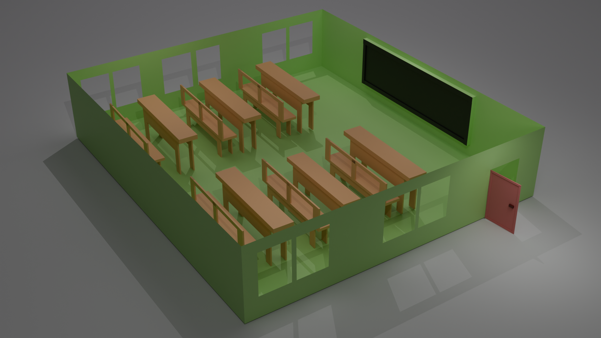
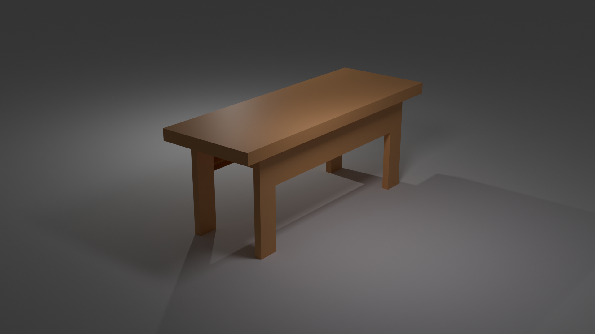

# 3D Classroom Model in Blender

🏫 A 3D model of a classroom created using **Blender** as part of my learning in 3D modeling and architectural visualization.

## 🔧 Tools Used
- Blender (Modeling, Texturing, Rendering)
- Cycles/Eevee (Rendering Engine)

## 📸 Previews

## 🎥 Demo Video 
[Click to Watch]([https://drive.google.com/yourlink](https://drive.google.com/file/d/1MtW0faqpq1E6TJ1vvWHVdvw5FB7XOeCC/view?usp=drive_link))  

---

Feel free to explore or give feedback!
